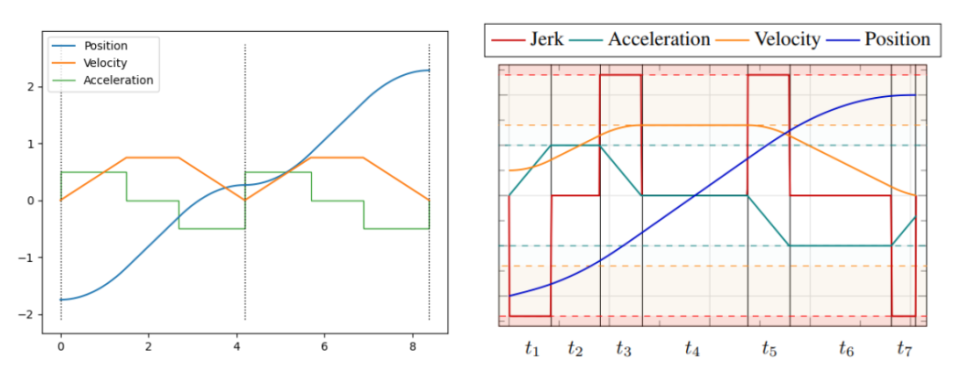

# My Note

Sampling method example
PRM
RRT
`/home/omid/manipulation/manipulation/exercises/trajectories/rrt_planner/rrt_planning.py`
example of it is at:
`/home/omid/manipulation/book/trajectories/exercises/rrt_planning.ipynb`

TrajOpt example
directiontranscription
directioncollocation
trajectoryoptimiztion

what can be done offline to save time in optimization problem?

example for
constraint in cartesian space

example
Redundnat Manipulator: seconday objective

## inspecting kinematic tree
`manipulation/book/pick/kinematic_tree.ipynb`

## forward kinematics
`manipulation/book/pick/forward_kinematics.ipynb`

## Jacobian - geometric
`manipulation/book/pick/jacobian.ipynb`

## Jacobian pseudoinverse
`manipulation/book/pick/pseudoinverse.ipynb`

The pseudo-inverse is a beautiful mathematical concept. 
- When the is square and full-rank, the pseudo-inverse returns the true inverse of the system. 
- When there are many solutions (here many joint velocities that accomplish the same end-effector spatial velocity), then it returns the minimum-norm solution (the joint velocities that produce the desired spatial velocity and are closest to zero in the least-squares sense). 
- When there is no exact solution, it returns the joint velocities that produce an spatial velocity which is as close to the desired end-effector velocity as possible, again in the least-squares sense. So good!

Singularity
A better metric, is to watch the smallest singular value; as this approaches zero, the norm of the pseudo-inverse will approach infinity. It is getting close to singularity.
The robot can go through singularity perfectly fine from joint space point of view, but the map from ee
to joint tells you that it can not. We are using first order derivative (jacobian), there is still
second order derivative that exists, the acceleration.

## IK
solve IK as a constrained optimization. Instead of using velocity and jacobian, we solve for solution that is close 
to the current configuration with forward kinematics being teh constraint
`https://manipulation.csail.mit.edu/trajectories.html#:~:text=IK%20as%20constrained%20optimization`
In the ipynb, we see the jumps to the next position for that. No command sent to the joints controller, it is just
changing the configureation of the robot. In this Ik optimization, we might find other solutions, of the IK but in diff IK (the jacobian one), we always find one that is closest to the current one. 

SNOPT is used to solve this nonconvex optimization
`manipulation/book/trajectories/interactive_ik.ipynb`

Now having all the solutions might be problem in the IK approach, because the arm might jump between 
solutions in one time steps. Look at the second example. sNOPT solves the nonconvex problem and finds solution
that are not in collision but it might not be smooth to transtion to them. In that case we do not want to use 
the output of the IK approach straight to the controller

## Motion planning - optimization

trajectory optimiztion:
    - direct transcription. discritizing the optimization problem. Usually min effort for cost
    and bunch of constraints which includes system dynamics
    not good when we need contact or collision (things from GraphScene)

    - shooting: its like direct transcription but we remove the state from decision variables, we 
    can have single shooting or multiple shooting

    - direct collocation. like direct transcription but uses cubic spline to reprent the path, so we can define less control points
    resuling in less variables. 
    `underactuated/book/trajopt/double_integrator.ipynb`
    `underactuated/book/trajopt/dircol.ipynb`

    - kinematics trajectory optimization:
    This is an extension of prvious IK approach but we are going to solve for a handful of points not one point. This is a kinda of DirectCollocation but without dynamics
    `manipulation/book/trajectories/kinematic_trajectory_optimization.ipynb`
    Drake uses B-spline which has the convex hull property to ensure that limits on the joint positions and any of its **derivatives** are satisfied. Note this is used in the optimiztion process not after calculating the path. Kinematics here does not mean that we do not set time derivative constraint but it means we do not have the dynanmics equations in the equality constraint like DirecCallocaiton or DirectTranscription have. Also, decision variables includes only q compare that with [q, qdot] and u (input) in dynamics optimization

Collocation is an idea about gradients of a continuous trajectory. It is only a relevant idea for continuous-time systems.

Direct transcription is well-defined for both discrete- and continuous- time. 

Direct transcription and collocation are not suitable for contact and collision check

The default solver is the SQP-solver, SNOPT.

some good examples:
https://github.com/vincekurtz/drake_ddp/blob/b4b22a55448121153f992cae453236f7f5891b23/acrobot.py#L177 

## Motion planning - sampling based
PRM (multiple enquery): roadmap construction, offline. graph search (online)
RRT (singel enquery)

There was an effort in Drake to use OMPL but it did not go anywhere

## Trajectory Generation
Time parameterize a path from (motion planning) so we can execcute that plan subject to velocity, 
acceleration and torque-limit constraint

**Trapezoidal** velocity and trpezoidal acceleation are two common methods.

<!--  -->
<figure>

<figcaption>left: trapezoidal velocity trajectory, right: trapezoidal acceleration trajecotyr from Ruckig</figcaption>
</figure>

We also could use **polynomials** of 3rd order or 5th roder. They are easy  to fit differentiable and continous. _Minimum jerk_ and _minimum snap_ trajectories are the polynomial  trajectories that minimizes jerk or snap.   
in trapezoidal profiles approach, we had hard constraints on following those trapezoids but in polynomial we made it loose. There is not guarantee that joints limits are satisfied between control points of the polynomials.      

**B-spline** is the approach to go becuse it gaurantees that the intermidiates poitns between control points stay in the convex hull and their derivaties do not overshoot. The tradeoff is that B-spline may not pass through all the control points (first and the last is guaranteed though)

**Time-optimal Trajectory Generation** (TOTG) is another method which attempts to alternate between max acceleration and deceleration (bang-bang)

In drake you could use `PathParameterizedTrajectory` to do these stuff

## Model Predictive Control

Its a dynamic trajectory optimiztion problem in a loop. With horizon cost and the final cost.
Horizon cost minimized the error between current and a reference trajectory. 
Also we could add min of the input control
Final cost, is termination time.
Decision variables: state and input

We also want a linear dynamic system, because we are solving this in a control loop and we need
fast response.


A good approach that Boston Dynamics uses is to divide the trajectory optimization into two parts:
Offline and Online.         
Offline: we do the heavy nonlinear trajectory optimization with all the constraints. This will be a template representing a behavious. They have a library of these behaviours. 

Online: Then for a given problem a behavior is selected. Then MPC is being used for the same problem but adapting the offline solution for the current environment.

The result of the offline step ($x_{TO}, u_{TO}$) is used in the running cost function as a reference but in a soft constriant manner. Also, the terminal/final cost includes the start and goal.


<figure>

<figcaption>Offline motion libraries and online MPC for advanced mobility skills by Marko Bjelonic et al </figcaption>
</figure>


## Optimization
in drake language, mathematical programs is the same is calling optimization methods
```
prog = MathematicalProgram()
x = prog.NewContinuousVariables(2)
prog.AddConstraint(x[0]+x[1] == 1)
prog.AddConstraint(x[0] <= x[1])
prog.AddCost(x[0] ** 2 + x[1] ** 2)
result = Solve(prog)
```

## BAZEL
bazel fetch @ompl//:ompl-1.5